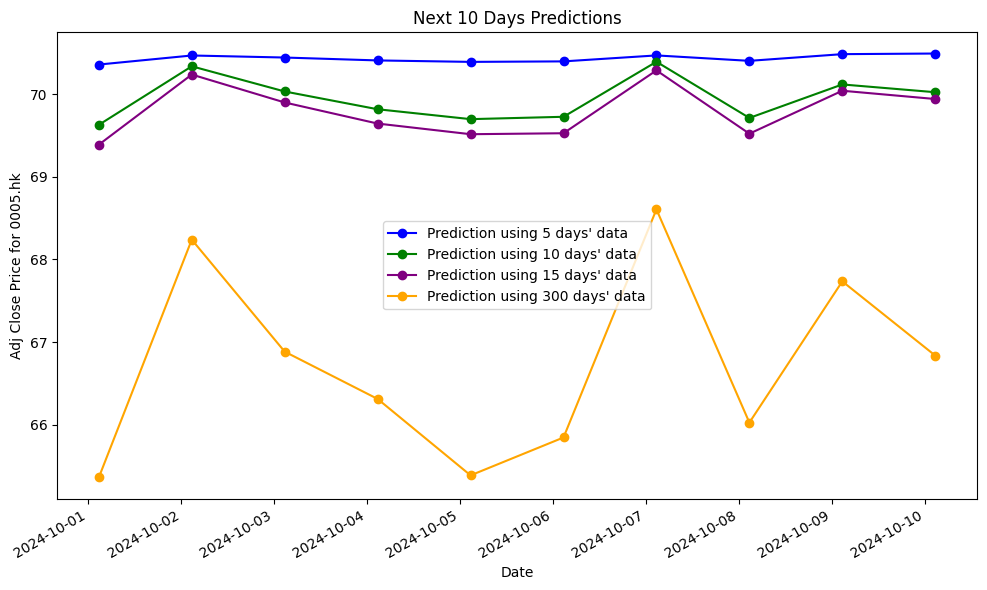

# stock_predictor

A simple transformer style model to predict stock price

## How to use?

Simply use the train.ipynb provided in this repo and run

A few parameters you might need to change to suit your need, please note that we use `yfinance` to download the data, please refer to the code that can be reconize by it.

```
stock_code = '0005.hk'
start_date = '2023-01-01'
interval = '1d'
```

## Sample output


